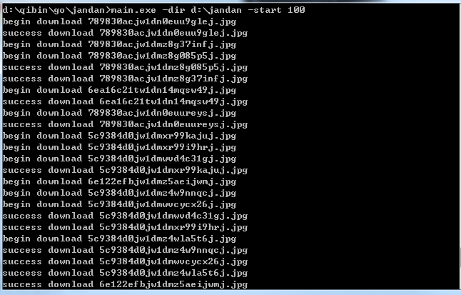

# JandanMeizar（注意：仅供娱乐）

golang实现抓取煎蛋妹子图

图片来源网站：[http://jandan.net](http://jandan.net)

依赖项目：[https://github.com/PuerkitoBio/goquery](https://github.com/PuerkitoBio/goquery)

编译源码前，请准备好以上项目， 方法：
``` go
go get github.com/PuerkitoBio/goquery
```

## 如何使用

window用户可以直接下载**win_exe**目录下在的zip文件，解压出一个main.exe文件。

其他平台用户，可以自行下载源码编译。

使用步骤(以windows为例)：

1. 打开命令行定位到编译文件所在目录
2. 输入命令：

> main.exe -dir D:\jandan -start 2009

## 参数说明

1. -dir 可选， 制定图片保存路径，默认保存当前目录/images/下
2. -start 可选，从多少页开始，默认从第2009页开始抓取(注意程序是按照页码倒序抓取的)
3. -cookie 可选，用户使用的cookie， chrome下可以打开[http://jandan.net](http://jandan.net)，按F12键，选择network项查看，这个参数主要在抓取时发生503错误使用的，默认不用指定

## 效果



^_^ 图片就不展示了， 大家可以自己运行看。
